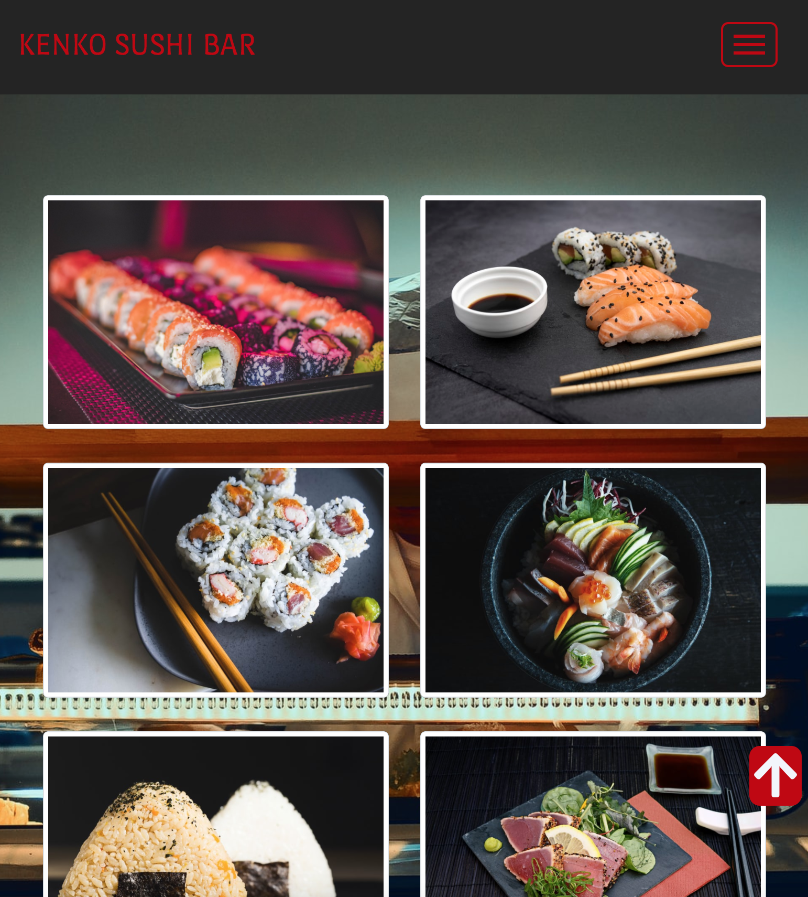
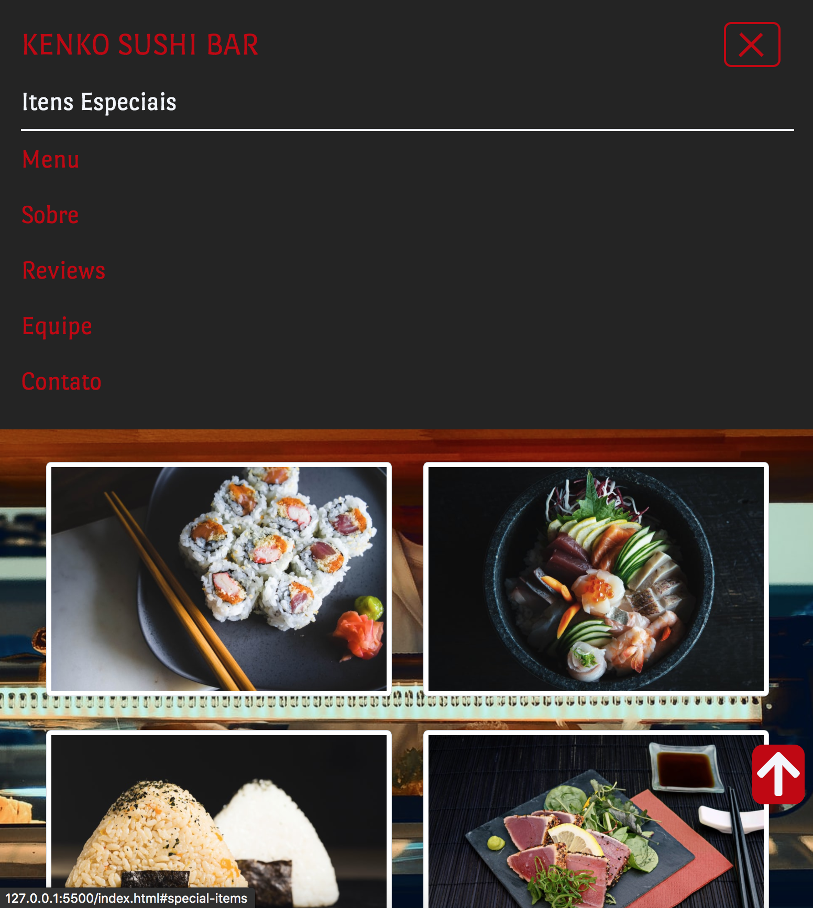

<h1 align="center">
    
</h1>
<h1 align="center">
    
</h1>
<h1 align="center">
    
</h1>
<h1 align="center">
    
</h1>

## 💻 About project

A web application made for a japanese restaurant from my region. It is a responsive web page, which can be opened in every device's size. The tecnologies used in this project is in the next section.

## 🛠 Technology

#### **Website**

-   **[HTML5](https://developer.mozilla.org/pt-BR/docs/Web/HTML/HTML5)**
-   **[CSS3](https://www.w3schools.com/css/)**
-   **[BOOTSTRAP 4](https://getbootstrap.com/)**
-   **[JQUERY](https://jquery.com/)**

#### **Utilitaries**

-   Editor: **[Visual Studio Code](https://code.visualstudio.com/)**
-   Fonts: **[Poiret One](https://fonts.googleapis.com/css2?family=Poiret+One&display=swap)**
-   Ripple Efect: **[Jquery Ripple Efect](https://github.com/sirxemic/jquery.ripples)**
-   Magnific Popup: **[Magnific Popup](https://dimsemenov.com/plugins/magnific-popup/)**
-   Colors: **[Palette](https://coolors.co/000000-8f030d-c10103-ff7d28-f2f5fb)**

### Prerequisites

Before you begin, you will need to have the following tool installed on your machine:
[Git](https://git-scm.com)

In addition, it is good to have an editor to work with the code as **[VSCode](https://code.visualstudio.com/)**

### Running the web application (Front End)

```bash
# Clone this repository
$ git clone https://github.com/luizmr/sushi-restaurant

# Access the project folder in the cmd/terminal
$ cd sushi-restaurant

# Run the application in terminal or open with Live Server
$ npx http-server
```

## 📝 License

This project is under the MIT license.

Made with ❤️ by Luiz Marcelo Rocha
